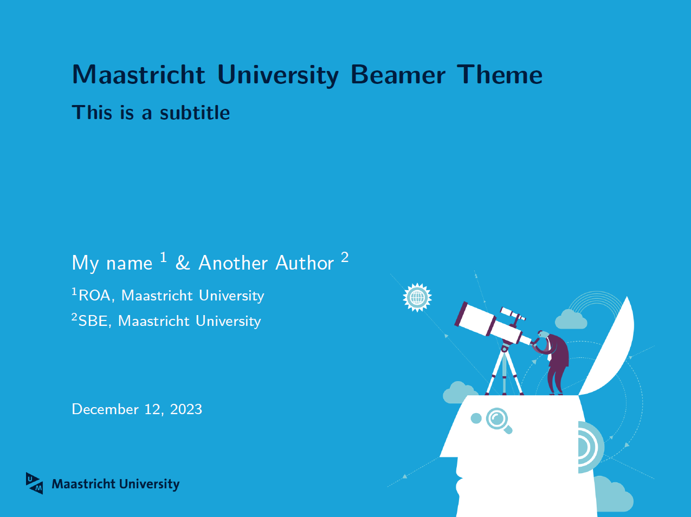
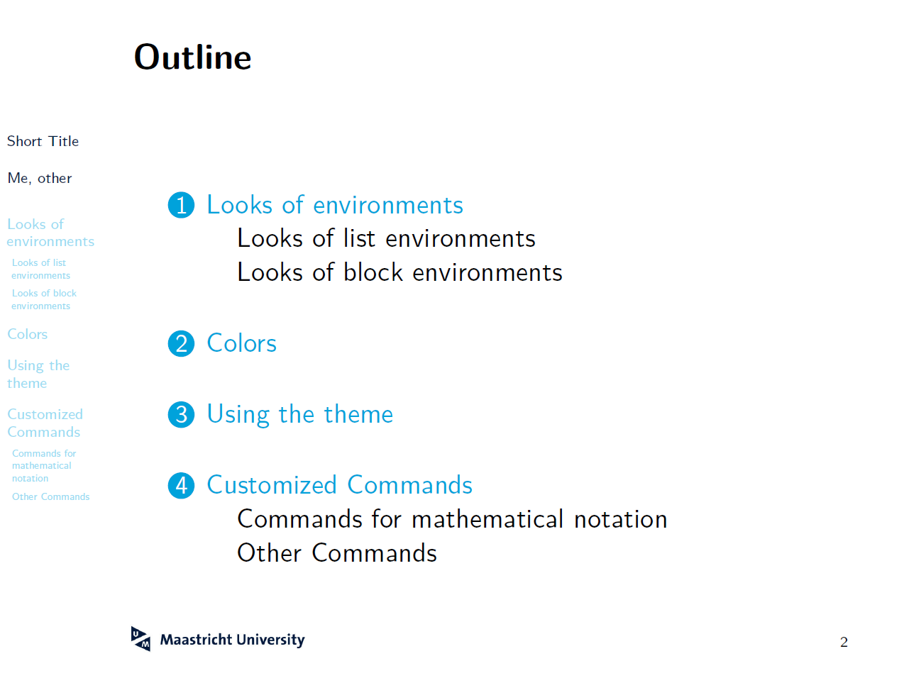
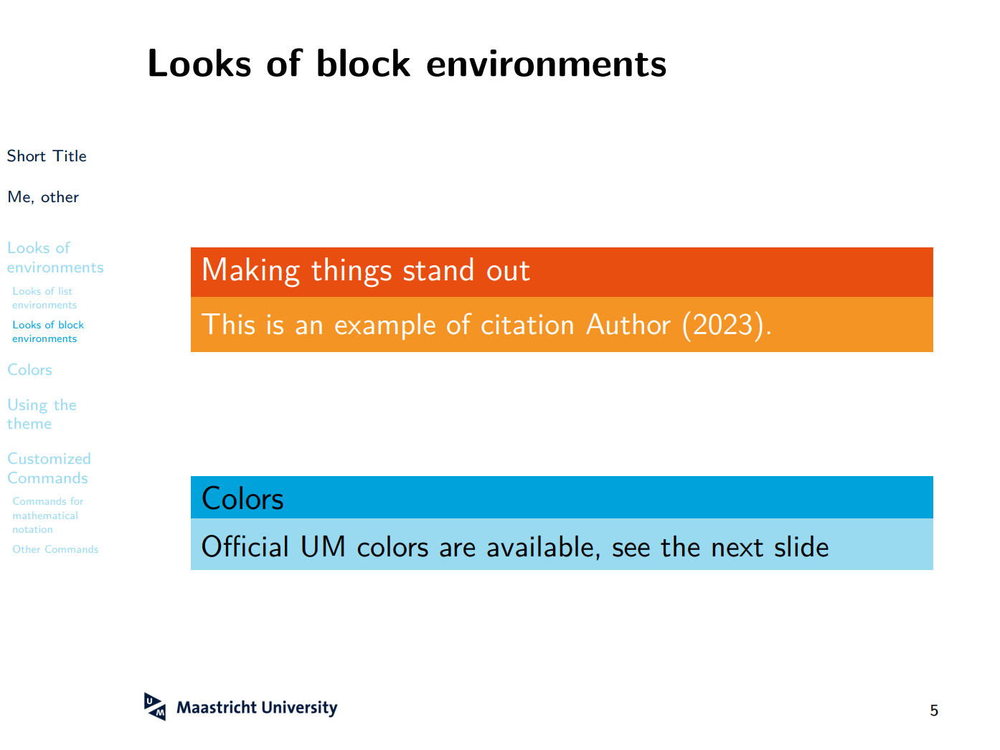

# Maastricht University Beamer Theme

LaTeX Beamer theme for [Maastricht University](https://www.maastrichtuniversity.nl/nl) based on the Microsoft Powerpoint template.


## Using the theme

See also the file `example.tex` for a working example on how to use the theme.

- Include `\usetheme{UM}` in the preamble.
- Use `\UMtitleframe` to generate the title page.

**Theme options**:

- `navigation`: Display a navigation bar on the left hand side.
- `sectiontitles`: Display a slide with the section title at the start of each section.

An example for using these options is given below:
```
\usetheme[navigation, sectiontitles]{UM}
```

## 16:9 aspect ratio adjustment

You can simply replace the first line in `example.tex' with:
```
\documentclass[pdfpagelabels=false, usepdftitle=false, aspectratio=169]{beamer}
```
and replace the inserted title background image at line 178 in `beamerthemeUM.sty' with a wide version:
```
\includegraphics[width=\paperwidth]{UMTitlePage_wide.PNG}
```

## Preview




## Acknowledgement
This template is adapted from Andreas Alfons's [beamer template for Erasmus School of Economics](https://github.com/aalfons/beamerthemeESE/tree/main).
